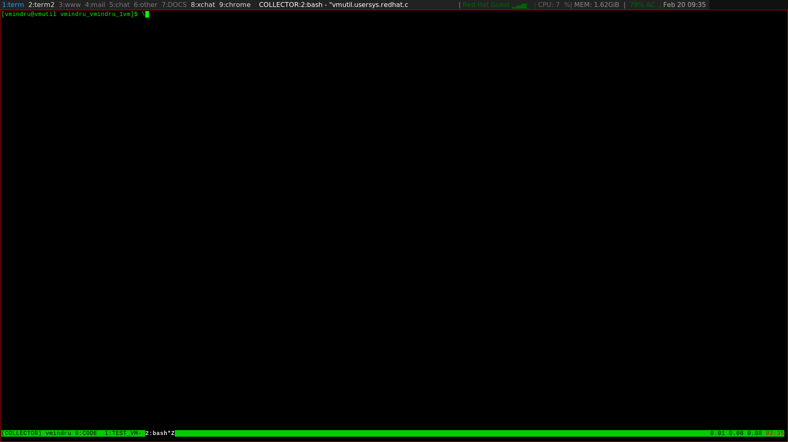

# DEPRECATED

this tools is deprecated, please use the offficail OpenStack tool https://github.com/openstack/ospurge/tree/master/ospurge 

# openstack-cleanall

this tool will automatically remove opnestack resources
of your tenant.
openstack resources will be removed in following order.

    - instances 
    - floating_ip
    - routers 
    - networks
    - security groups
    - keypairs

this tool will prevent you running this as user admin or under project amdin.


## setup  

following ENV variables must be set in your shell, this are similar to standard
nova client auth mechanism.

```
OS_AUTH_URL
OS_USERNAME
OS_PASSWORD
OS_PROJECT_NAME
```

e.g.

```
export 
OS_AUTH_URL=http://openstack.com/v2.0/ # URL to access Open Stack nova API
OS_USERNAME=user # your Open Stack user
OS_PASSWORD=somesecretpassword # your Open Stack password
OS_PROJECT_NAME=someopenstackproject # your Open Stack project|tenant name
```
## help message

```
[vmindru@vmutil openstasck-cleanall]$ ./openstack-clean-all.py --help
Usage: openstack-clean-all.py [options]

Options:
  --version             show program's version number and exit
  -h, --help            show this help message and exit
  -y, --yes             do not ask for confirmation during removal.
                        WARNING: this will remove all your resources without
                        confirmation, use with care!!!
  -e ELEMENT, --element=ELEMENT
                        remove specified resource, available options are: [ser
                        vers,floating_ips,routers,networks,security_groups,key
                        pairs,all]. WARNING: will remove all dependecides as
                        well
[vmindru@vmutil openstasck-cleanall]$ 
```

## demo 

